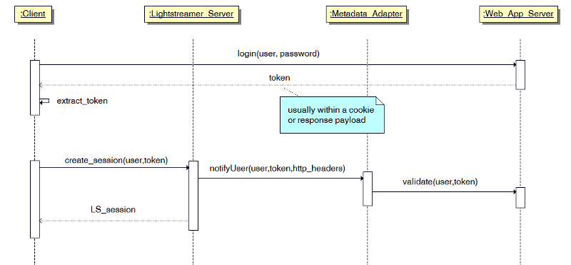

# Lightstreamer - Authentication and Authorization Demo - HTML Client

The Lightstreamer Authentication and Authorization Demo is a simple example illustrating *authentication* and *authorization* mechanisms when an 
*external Web/Application Server* is involved in the process.

This project includes a simple web client front-end example for the [Lightstreamer - Authentication and Authorization Demo - Java Adapter](https://github.com/Weswit/Lightstreamer-example-AuthMetadata-adapter-java).


## Details

This *Authentication and Authorization Demo* illustrates the typical best practice used for Lightstreamer Web applications, when a Web/Application server is involved in the process. 
The actual authentication is usually handled by the legacy Web/Application server, irrespective of Lightstreamer. 

from `src/index.js`:
```js
[...]

$.ajax({
  url: "js/login.js",
  type: "POST",
  data: {
    user: user,
    password: password,
  },
  
[...]
```
Some sort of token is sent back to the Client through cookies, response payload or any other technique. 
When the Web Client creates the Lightstreamer session, instead of sending again the full credentials (usually involving a password) to 
Lightstreamer Server, it sends just the username and the token. 

from `src/index.js`:
```js
[...]

lsClient.connectionDetails.setUser(user);
lsClient.connectionDetails.setPassword(token); //send the token, not the password, to the Lightstreamer server
lsClient.connect();
  
[...]
```

The Metadata Adapter is passed this information and validates the token against the Web/Application Server that 
generated it (or a database or whatever back-end system).

Here an overview of the whole sequence:



In this demo client the Web/Application server is not actually involved and calls to placeholder methods are performed to obtain and extract the token.

Once the user is authenticated on the Lightstreamer server as explained above, the client interface presents a list of items that can be subscribed. Every time an item is subscribed 
the Lightstreamer Server proceeds with the authorization of the request; each one of the username available in the demo is bound to a list of items it is authorized to view. Again the
server might use an external service to verify if the received request is a valid one or not: 
more details on this are shown in the [Adapter project](https://github.com/Weswit/Lightstreamer-example-AuthMetadata-adapter-java).


## Install

If you want to install a version of this demo pointing to your local Lightstreamer Server, follow these steps:
* The [Lightstreamer - Authentication and Authorization Demo - Java Adapter](https://github.com/Weswit/Lightstreamer-example-AuthMetadata-adapter-java) has to be deployed on your local 
Lightstreamer Server instance. Please check out that project and follow the installation instructions provided with it.
* Download this project.
* Lightstreamer JS client is currently hot-linked in the html page: you may want to replace it with a local version and/or to upgrade its version.
* RequireJS is currently hot-linked in the html page: you may want to replace it with a local version and/or to upgrade its version.
* jQuery is currently hot-linked in the html page: you may want to replace it with a local version and/or to upgrade its version.
* Deploy this demo on the Lightstreamer Server (used as Web server) or in any external Web Server: copy there the contents of the `/src` folder of this project.
The client demo configuration assumes that Lightstreamer Server and this client are launched on the same machine. If you need to target a 
different Lightstreamer server, please open the `src/js/Constants.js` and configure the SERVER element accordingly. 
* Open your browser and point it to to the newly deployed folder.

## See Also

### Lightstreamer Adapters Needed by This Client

* [Lightstreamer - Authentication and Authorization Demo - Java Adapter](https://github.com/Weswit/Lightstreamer-example-AuthMetadata-adapter-java)

## Lightstreamer Compatibility Notes

* Compatible with Lightstreamer JavaScript Client library version 6.0 or newer.
